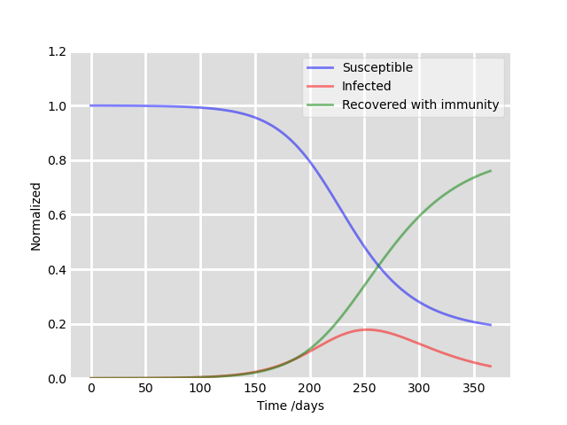

# Mathematical-modelling-of-COVID-19-transmission
Academic research under the supervision of Dr. Valluri; presented results at the 17th International Conference on Nanosciences & Nanotechnologies.

Currently finishing up manuscript for external publication.

